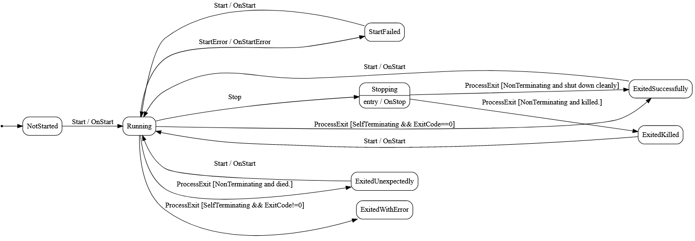

# Little Forker

[](https://github.com/damianh/LittleForker/actions?query=workflow%3ACI)
[](https://www.nuget.org/packages/LittleForker)
[](https://f.feedz.io/dh/oss-ci/nuget/index.json)

A utility to aid in the launching and supervision of processes. The original use
case is installing a single service who then spawns other processes as part of a
multi-process application.

## Features

  1. **ProcessExitedHelper**: a helper around `Process.Exited` with some additional
     logging and event raising if the process has already exited or not found.

  2. **ProcessSupervisor**: allows a parent process to launch a child process
     and lifecycle is represented as a state machine. Supervisors can participate
     in co-operative shutdown if supported by the child process.

  3. **CooperativeShutdown**: allows a process to listen for a shutdown signal
     over a NamedPipe for a parent process to instruct a process to shutdown.

## Installation

```bash
dotnet add package LittleForker
```

CI packages are on personal feed: https://www.myget.org/F/dh/api/v3/index.json

## Using

### 1. ProcessExitedHelper

This helper is typically used by "child" processes to monitor a "parent" process
so that it exits itself when the parent exists. It's also safe guard in
co-operative shut down if the parent failed to signal correctly (i.e. it
crashed).

It wraps `Process.Exited` with some additional behaviour:

- Raises the event if the process is not found.
- Raises the event if the process has already exited which would otherwise
  result in an `InvalidOperationException`
- Logging.

This is something simple to implement in your own code so you may
consider copying it if you don't want a dependency on `LittleForker`.

Typically you will tell a process to monitor another process by passing in the
other process's Id as a command line argument. Something like:

```bash
.\MyApp --ParentProcessID=12345
```

Here we extract the CLI arg using `Microsoft.Extensions.Configuration`, watch
for a parent to exit and exit ourselves when that happens.

```csharp
var configRoot = new ConfigurationBuilder()
   .AddCommandLine(args)
   .Build();

var parentPid = _configRoot.GetValue<int>("ParentProcessId");
using(new ProcessExitedHelper(parentPid, exitedHelper => Environment.Exit(0)))
{
   // Rest of application
}
```

`Environment.Exit(0)` is quite an abrupt way to shut town; you may want to
handle things more gracefully such as flush data, cancel requests in flight etc.
For an example, see
[NotTerminatingProcess](src/NonTerminatingProcess/Program.cs) `Run()` that uses
a `CancellationTokenSource`.

### 2. ProcessSupervisor

Process supervisor launches a process and tracks it's lifecycle that is represented by a
state machine. Typically use case is a "parent" processes launching one or more "child"
processes.

There are two types of processes that are supported:

1. **Self-Terminating** where the process will exit of it's own accord.
2. **Non-Terminating** is a process that never shut down unless it is
   signalled to do so (if it participates in co-operative shutdown) _or_ is killed.

A process's state is represented by `ProcessSupervisor.State` enum:

- NotStarted,
- Running,
- StartFailed,
- Stopping,
- ExitedSuccessfully,
- ExitedWithError,
- ExitedUnexpectedly,
- ExitedKilled

... with the transitions between them described with this state machine depending
whether self-terminating or non-terminating:



Typically, you will want to launch a process and wait until it is in a specific
state before continuing (or handle errors).

```csharp
// create the supervisor
var supervisor = new ProcessSupervisor(
   processRunType: ProcessRunType.NonTerminating, // Expected to be a process that doesn't stop
   workingDirectory: Environment.CurrentDirectory,
   processPath: "dotnet",
   arguments: "./LongRunningProcess/LongRunningProcess.dll");

// attach to events
supervisor.StateChanged += state => { /* handle state changes */ };
supervisor.OutputDataReceived += s => { /* console output */ }

// start the supervisor which will launch the process
await supervisor.Start();

// ... some time later
// attempts a co-operative shutdown with a timeout of 3
// seconds otherwise kills the process

await supervisor.Stop(TimeSpan.FromSeconds(3));
```

With an async extension, it is possible to await a supervisor state:

```csharp
var exitedSuccessfully = supervisor.WhenStateIs(ProcessSupervisor.State.ExitedSuccessfully);
await supervisor.Start();
await Task.WhenAny(exitedSuccessfully).
```

You can also leverage tasks to combine waiting for various expected states:

```csharp
var startFailed = supervisor.WhenStateIs(ProcessSupervisor.State.StartFailed);
var exitedSuccessfully = supervisor.WhenStateIs(ProcessSupervisor.State.ExitedSuccessfully);
var exitedWithError = supervisor.WhenStateIs(ProcessSupervisor.State.ExitedWithError);

supervisor.Start();

var result = await Task.WhenAny(startFailed, exitedSuccessfully, exitedWithError);
if(result == startFailed)
{
   Log.Error(supervisor.OnStartException, $"Process start failed {supervisor.OnStartException.Message}")
}
// etc.
```

### CooperativeShutdown

Cooperative shutdown allows a "parent" process to instruct a "child" process to
shut down. Different to `SIGTERM` and `Process.Kill()` in that it allows a child
to acknowledge receipt of the request and shut down cleanly (and fast!). Combined with
`Supervisor.Stop()` a parent can send the signal and then wait for `ExitedSuccessfully`.

The inter-process communication is done via named pipes where the pipe name is
of the format `LittleForker-{processId}`

For a "child" process to be able receive co-operative shut down requests it uses
`CooperativeShutdown.Listen()` to listen on a named pipe. Handling signals should
be fast operations and are typically implemented by signalling to another mechanism
to start cleanly shutting down:

```csharp
var shutdown = new CancellationTokenSource();
using(await CooperativeShutdown.Listen(() => shutdown.Cancel())
{
   // rest of application checks shutdown token for co-operative
   // cancellation. See MSDN for details.
}
```

For a "parent" process to be able to signal:

```csharp
await CooperativeShutdown.SignalExit(childProcessId);
```

This is used in `ProcessSupervisor` so if your parent process is using that, then you
typically won't be using this explicitly.

## Building

With docker which is same as CI:

- Run `build.cmd`/`build.sh` to compile, run tests and build package.

Local build which requires .NET Core SDKs 2.1, 3.1 and .NET 5.0:

- Run `build-local.cmd`/`build-local.sh` to compile, run tests and build package.

## Credits & Feedback

[@randompunter](https://twitter.com/randompunter) for feedback.

Hat tip to [@markrendle](https://twitter.com/markrendle) for the project name.
